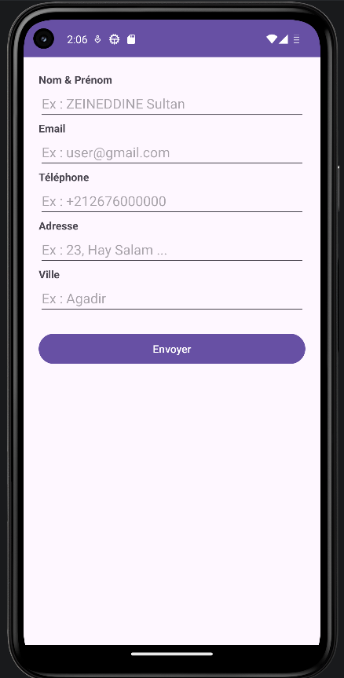
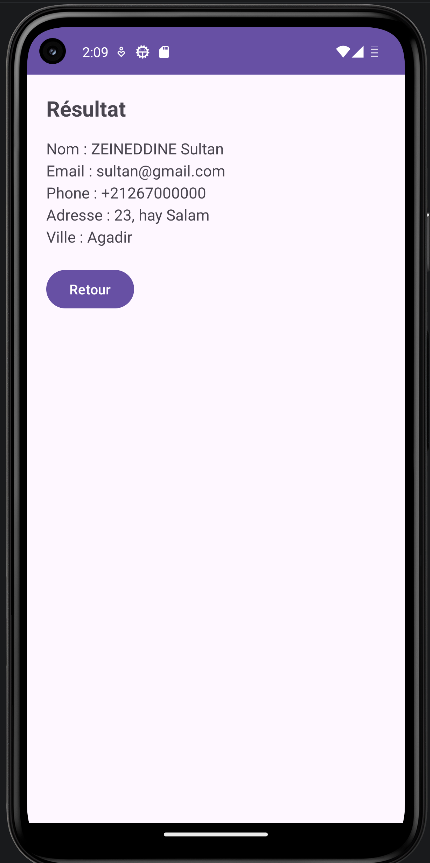

# LAB 3 - Navigation et Transfert de Données (Intents) 


## À propos du projet
Ce projet représente le troisième laboratoire de mon apprentissage en **Programmation Mobile : Android avec Java**. 

L'objectif majeur de cette application est d'introduire l'architecture multi-écrans. Contrairement aux applications précédentes qui se déroulaient sur une seule page d'interface, ce projet démontre comment collecter des données utilisateur sur un premier écran, puis les transmettre de manière sécurisée pour les afficher sur un second écran grâce au mécanisme des **Intents**.

## Fonctionnalités
L'application est scindée en deux vues interactives :
1. **Écran de Saisie (Formulaire) :** Permet à l'utilisateur de renseigner ses informations (Nom, Email, Téléphone, Adresse, Ville). Il intègre une validation de sécurité empêchant l'envoi si les champs obligatoires sont vides.
2. **Écran de Récapitulatif :** Intercepte les données envoyées par le formulaire et les affiche de manière formatée. Un bouton "Retour" permet de fermer la page en cours et de revenir au formulaire initial.

## Aperçu
 
## Concepts techniques abordés
Ce laboratoire m'a permis d'assimiler des concepts fondamentaux du système Android :
* **Les Intents Explicites :** Utilisation de la classe `Intent` pour instancier et déclencher la transition de `MainActivity` vers `Screen2Activity`.
* **Le Transfert de Données (Extras) :** Emballage des données textuelles sous forme de paires clé/valeur via `putExtra()` et récupération sur l'écran d'arrivée via `getStringExtra()`.
* **Cycle de vie et Navigation :** Utilisation de `startActivity()` pour empiler une nouvelle activité, et de `finish()` pour détruire l'activité courante et dépiler l'écran précédent.
* **Le Manifest Android :** Compréhension de l'obligation de déclarer chaque nouvelle vue (Activity) dans le fichier `AndroidManifest.xml`.
* **Ergonomie UI :** Implémentation d'un composant `ScrollView` pour garantir l'accessibilité du formulaire sur les petits écrans, et ciblage des claviers virtuels (`inputType="textEmailAddress"`, `phone`, etc.).

## Comment lancer le projet en local

1. Clonez ce dépôt sur votre machine locale :
   ```bash
   git clone https://github.com/Sultan-zd/Lab3-MultiEcrans.git
2. Ouvrez Android Studio.
3. Sélectionnez File > Open et choisissez le dossier du projet cloné.
4. Laissez Gradle synchroniser les dépendances.
5. Cliquez sur le bouton Run (le triangle vert) pour lancer l'application sur un émulateur ou un appareil physique.


